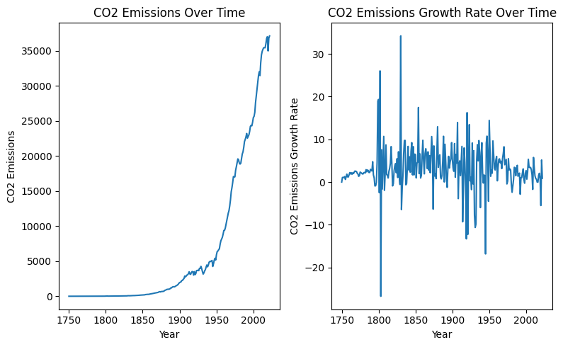
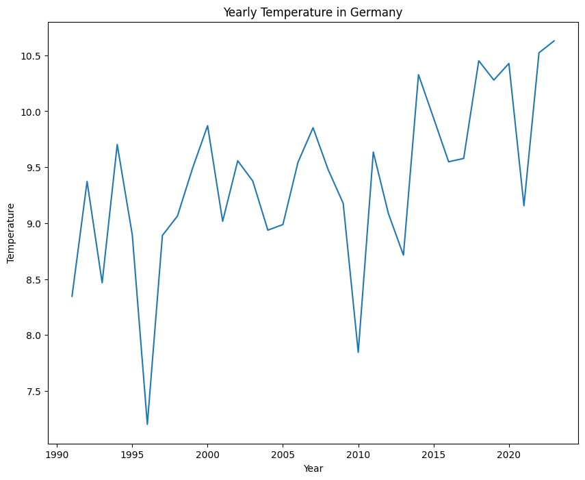
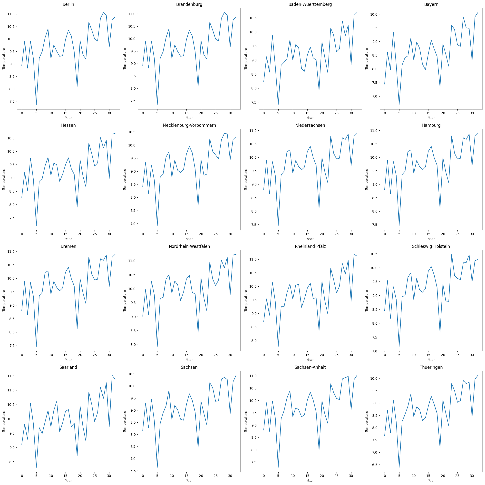
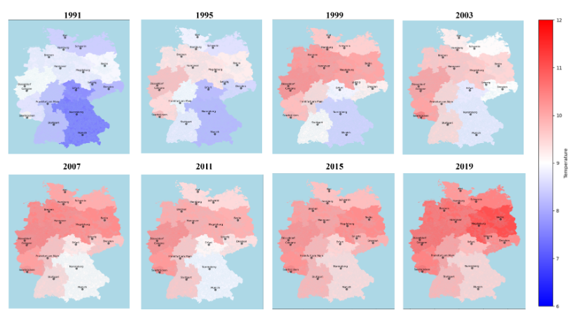
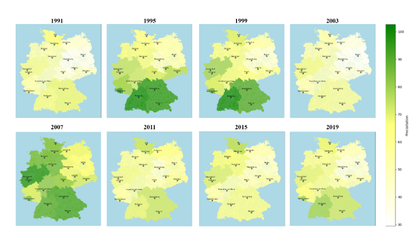
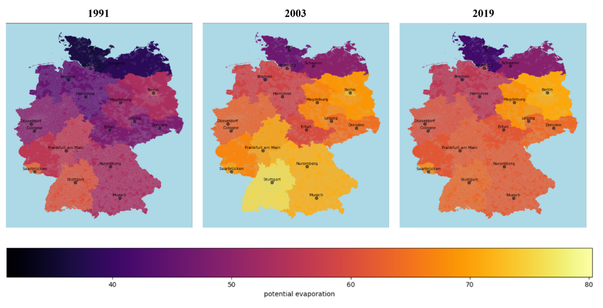
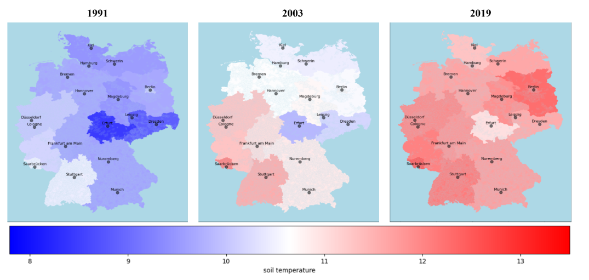
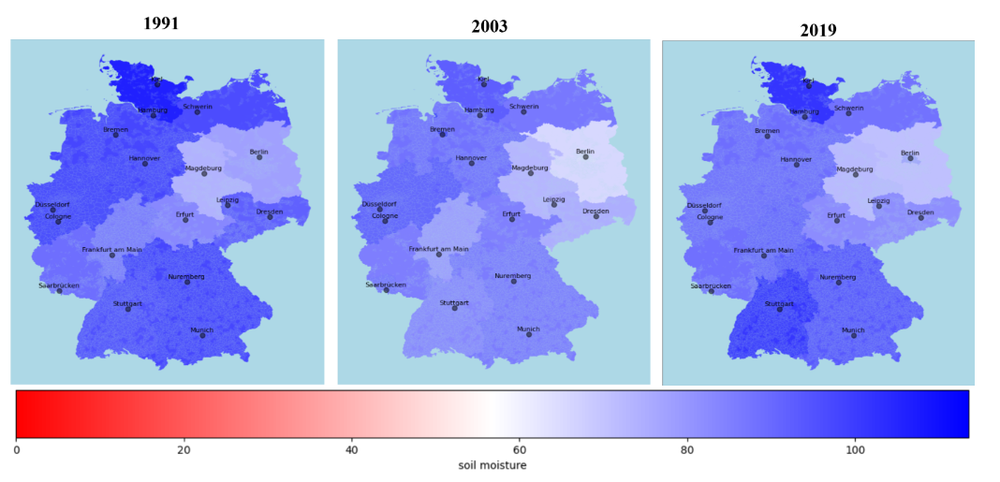

# Exercise Badges

    

# Analysis regarding CO2, precipitation and temperature affection on soil conditions
<!-- Give your project a short title. -->

## Main Question

<!-- Think about one main question you want to answer based on the data. -->
1. How has the temperature changed in Germany over the years?
2. How has the global CO2 emission changed over the years?
3. How has the precipitation changed in Germany over the years?
4. How has soil condition changed in Germany over the years?
5. How does the global CO2 emission, temperature change and precipitation affect the soil condition?

## Description

<!-- Describe your data science project in max. 200 words. Consider writing about why and how you attempt it. -->
The change of soil condition led by climate change is an important problem, because changes of soil condition affects the agriculture, which may inadvertently influence human society .This projects first analyses correlation between global emission of carbon dioxide CO2 and temperature, using Pearson's correlation .The results can give insights into how does CO2 increases the temperature. Secondly, the project analyses the precipitation and CO2. Finally, it analyses the soil condition's correlation with CO2, temperature and precipitation, trying to discover whether the climate change plays a role in soil condition.

## Datasources

<!-- Describe each datasources you plan to use in a section. Use the prefic "DatasourceX" where X is the id of the datasource. -->

### Datasource1: Data on CO2 and Greenhouse Gas Emissions by Our World in Data
* Metadata URL: https://github.com/owid/co2-data/blob/master/owid-co2-codebook.csv
* Data URL: https://nyc3.digitaloceanspaces.com/owid-public/data/co2/owid-co2-data.csv
* Data Type: CSV

The datasource consists of CO2 emissions of different countries from 1850 to 2022. The data source records detailed emission source, from oil, gas, industry ...etc. Moreover, emission per capita and per GDP is also accounted.

### Datasource2: Regional average value for historical monthly mean temperature
* Metadata URL: https://www.dwd.de/EN/ourservices/cdc/cdc_ueberblick-klimadaten_en.html;jsessionid=31CF9807245E6D5DC250829F80D5EF75.live21071?nn=495490#doc725352bodyText4:~:text=4.-,Average%20values%20for%20the%20individual%20federal%20states%20and%20for%20Germany%20as%20a%20whole,-The%20mean%20values
* Data URL: https://opendata.dwd.de/climate_environment/CDC/regional_averages_DE/monthly/air_temperature_mean/
* Data Type: CSV directory

The datasource consists of German regional average values for historical monthly mean temperature. The dataset dates back to 01.1881 until 01.2024.

### Datasource3: Regional average value for historical monthly mean precipitation
* Metadata URL: https://www.dwd.de/EN/ourservices/cdc/cdc_ueberblick-klimadaten_en.html;jsessionid=31CF9807245E6D5DC250829F80D5EF75.live21071?nn=495490#doc725352bodyText4:~:text=4.-,Average%20values%20for%20the%20individual%20federal%20states%20and%20for%20Germany%20as%20a%20whole,-The%20mean%20values
* Data URL: https://opendata.dwd.de/climate_environment/CDC/regional_averages_DE/monthly/precipitation/
* Data Type: CSV

The datasource consists of German regional average values for historical monthly mean precipitation. The dataset dates back to 01.1881 until 01.2024.

### Datasource4: Historical monthly soil condition data in Germany
* Metadata URL: https://opendata.dwd.de/climate_environment/CDC/derived_germany/soil/monthly/historical/DESCRIPTION_derivgermany_soil_monthly_historical_en.pdf
* Data URL: https://opendata.dwd.de/climate_environment/CDC/derived_germany/soil/monthly/historical/
* Data Type: GZ file directory

The datasource consists of historical monthly soil conditions in Germany at different stations, from 01.1991 to 12.2023. Soil Properties, like soil moisture,soil temperatures ..etc are included.

### Datasource 5: Data of soil station in Germany
* Data URL: https://opendata.dwd.de/climate_environment/CDC/derived_germany/soil/monthly/historical/derived_germany_soil_monthly_historical_stations_list.txt
* Data Type: CSV

The datasource is assistance datasource, mainly cooperating with datasource 4, can be used for station details by station Index provided in datasource 4. The datasource consists of data Index, station name, station position...etc.

### Data source 6: Germany Geography
* Data URL: https://downloads.suche-postleitzahl.org/v2/public/plz-5stellig.shp.zip
* Data Type: SHP

The datasource contains postal code and geographical information(GS84 polygon format) of each city in Germany
  
### Data source 7: Germany postcode
* Data URL: https://downloads.suche-postleitzahl.org/v2/public/zuordnung_plz_ort.csv'
* Data Type: CSV

The datasource contains postal code, name and federal state of each city in Germany.

## Work Packages

<!-- List of work packages ordered sequentially, each pointing to an issue with more details. -->

1. Searching suitable source of CO2 emission, temperature change, precipitation and soil conditions
2. Check data source license and availability
3. Writing project plan
4. Building automated pipelines
   1. Building automated ETL pipelines
   2. Building automated Continuous Integration pipelines
   3. Building automated testing pipelines
5. Data analysis
6. Conclusion

## Part of Analysis Result

### Global CO2 emission change over the years

### Temperature change in Germany

#### Temperature change in each federal states

### Precipiation change

### Soil condition change

