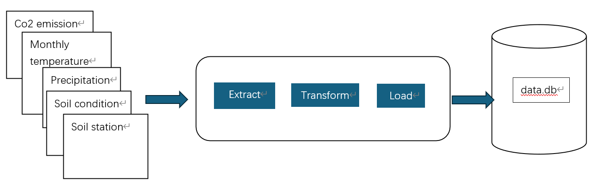

### Main Question
1. How has the temperature changed in Germany over the years?
2. How has the global CO2 emission changed over the years?
3. How has the temperature change and global CO2 emission affected the precipitation in Germany?
4. How does the global CO2 emission, temperature change and precipitation affect the soil condition?

### Data sources
For this project, we have selected 5 data sources, which are global CO2, German regional monthly temperature, German regional monthly precipitation, German monthly soil condition and soil station.
The detail of each data source can be found below in the table. All the datasources are allowed to use since they're CC BY 4.0 licensed. It can be free of use,distribute and modify in any media form as long as attributing the original source.

||License|filetype|Accuracy|Completeness|Consistency|Timeliness|Relevancy
|-|-|-|-|-|-|-|-
|Datasource 1|CC BY 4.0|CSV|Uncertain, the data is computed from multiple sources by the author|Somehow, some cell missing|Yes|Yes|Yes
|Datasource 2|CC BY 4.0|CSV directory|Yes|Yes|Yes|Yes|Yes
|Datasource 3|CC BY 4.0|CSV|Yes|Yes|Yes|Yes|Yes
|Datasource 4|CC BY 4.0|GZ file directory|Yes|Yes|Yes|Yes|Yes
|Datasource 5|CC BY 4.0|CSV|Yes|Yes|Yes|Yes|Yes

#### Datasource 1: Data on CO2 and Greenhouse Gas Emissions by Our World in Data
* Metadata URL: https://github.com/owid/co2-data/blob/master/owid-co2-codebook.csv
* Data URL: https://nyc3.digitaloceanspaces.com/owid-public/data/co2/owid-co2-data.csv

The datasource consists of CO2 emissions of different countries from 1850 to 2022. The data source records detailed emission source, from oil, gas, industry ...etc. Moreover, emission per capita and per GDP is also included.

#### Datasource 2: Regional average value for historical monthly mean temperature
* Metadata URL: https://www.dwd.de/EN/ourservices/cdc/cdc_ueberblick-klimadaten_en.html
* Data URL: https://opendata.dwd.de/climate_environment/CDC/regional_averages_DE/monthly/air_temperature_mean/

The datasource consists of German regional average values for historical monthly mean temperature, e.g average temperature in Bayern.
#### Datasource 3: Regional average value for historical monthly mean precipitation
* Metadata URL: https://www.dwd.de/EN/ourservices/cdc/cdc_ueberblick-klimadaten_en.html
* Data URL: https://opendata.dwd.de/climate_environment/CDC/regional_averages_DE/monthly/precipitation/

The datasource consists of German regional average values for historical monthly mean precipitation, e.g average precipitation amount in Bayern.

#### Datasource 4: Historical monthly soil condition data in Germany
* Metadata URL: https://opendata.dwd.de/climate_environment/CDC/derived_germany/soil/monthly/historical/DESCRIPTION_derivgermany_soil_monthly_historical_en.pdf
* Data URL: https://opendata.dwd.de/climate_environment/CDC/derived_germany/soil/monthly/historical/

The datasource consists of historical monthly soil conditions in Germany at different stations, from 01.1991 to 12.2023. Soil Properties, like soil moisture,soil temperatures ..etc are included.

#### Side Datasource: Data of soil station in Germany
* Data URL: https://opendata.dwd.de/climate_environment/CDC/derived_germany/soil/monthly/historical/derived_germany_soil_monthly_historical_stations_list.txt

The datasource is assistance datasource, mainly cooperating with datasource 4, can be used for station details by station Index provided in datasource 4. The datasource consists of data Index, station name, station position...etc.

### Data pipeline
There are five data sources in the project. The ETL pipeline takes the link of data source, extracting, transform and loading the data source in a sequence. The Figure 1 shows this procedure.

#### Extract Data
We use requests library to fetch the datasource. For datasource 1 and 5, we directly the link to download the data since the links are already the file we require. For datasource 2,3 and 4, which are csv directory and gz directory link, extraction and filter on the fetched html content to obtain link list is conducted. Files in the link list are one-by-one downloaded.

Figure 1

#### Transform Data
Once the data extraction finishes, the data are read by Pandas and be ready to be transformed.
* Regular methodlogies like data cleaning, data selection and data column renaming are applied.
* For a datasource linking directory, we concatenate its all dataframe.
* We also restrict the prototype of the datasource, which requires the datasource columns should at least the columns in the prototype. Otherwise, it throws an exception, and the pipeline fails.
* We Specify the each column in prototype with its data type. If some column in a row is not compatible with the data type defined, the row is cleaned.
* The values in datasource 5's column Name are in German letter and datasource 2,3 's column are in English letter. In order to make them compatible, we convert the German Umlauts(ä,ö,ü,ß) to its English form.
* The time varies in our datasources. Therefore, we find the set of common years and months in datasource 2,3,4. Select the data fitting those years and months.
* We join the datasource 4 and datasource 5 in the end.

The pipelines described above is flexible when the input data changes. As long as the datasource is still under the interface of the prototypes, namely its structure is the child class of the prototype (from OOP view), our pipeline can still handle that.

#### Load data
We choose SQL database to load the data. We have thought of several other ways before. But considering SQL is structured, typed and can put constraints, we choose it. We load all the data frame into one SQL db file.

#### Limitation
* Data source 1 is a little of doubtful. The data source can date back to 1800'S, which is unbelievable. 
* Data source 1 might be exaggerative, since it's published by Environmental organization. To advocate more environment low carbon, exaggeration on CO2 amount can occur.
* The Main questions seems to too complicated with the data source. The soil conditions in physical world are affected by multiple large amount of factors. The datasource in this project might be insufficient to find answers.
* We haven't checked the correctness of German state names(e.g Bayern) in our datasource, there might exist some typos.